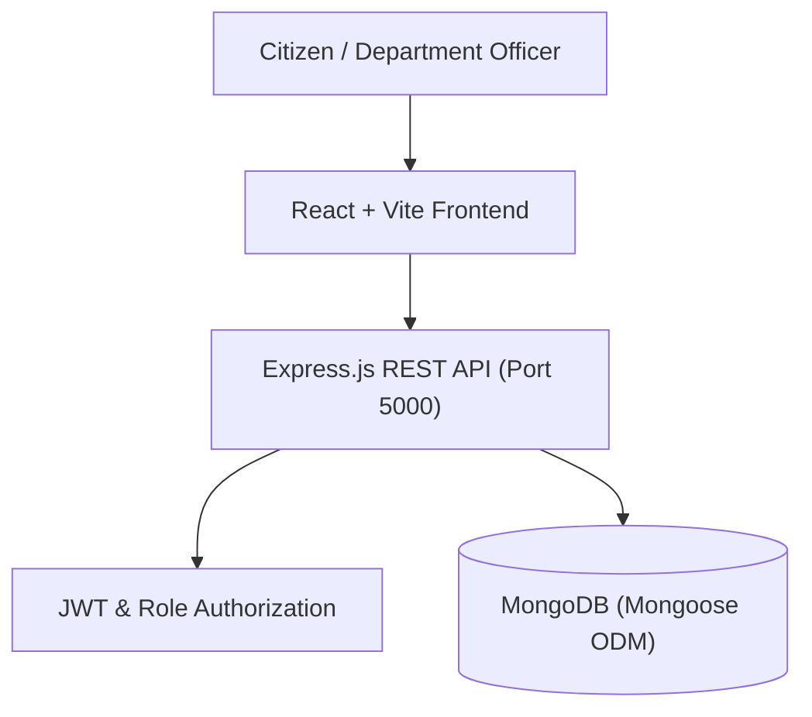
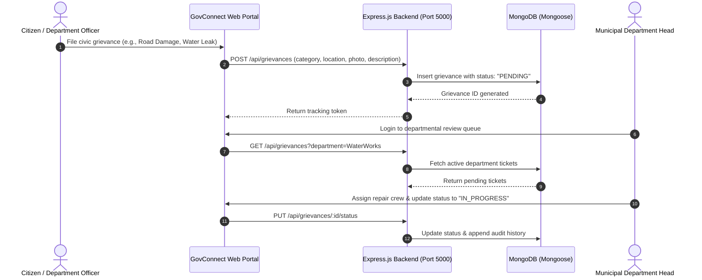

# GovConnect — Inter-Departmental Cooperation & Grievance Platform
[]()
[]()
[]()
[]()

## Overview
GovConnect is a civic tech collaboration and inter-departmental grievance management system built on Node.js, Express, MongoDB (Mongoose), React, and Tailwind CSS. The platform enables government agencies, municipal departments, and civic officers to collaborate across administrative boundaries, dispatch citizen grievances, share resources, and track resolution SLAs.

- **Problem Solved:** Siloed departmental communication leading to delayed civic issue resolution and unaccountable citizen grievance handling.
- **Target Users:** Municipal officers, department heads, civic administrators, and citizens.
- **Current Status:** Functional Full-Stack System.

## Features
- **Inter-Departmental Ticket Routing:** Assign grievances across departments (Water, Electricity, Roads, Health).
- **SLA & Escalation Tracking:** Automated monitoring of resolution timelines with visual deadline meters.
- **Departmental Resource Sharing:** Intra-agency asset and personnel dispatch coordination.
- **Citizen Grievance Portal:** Public submission and tracking with status telemetry.

## Architecture


## User Flow


## Technology Stack
| Layer | Technology | Purpose |
|---|---|---|
| Frontend | React, Vite, Tailwind CSS | Administrative portal and citizen portal |
| Backend | Node.js, Express.js | API business logic, ticket routing, and notifications |
| Database | MongoDB, Mongoose ODM | Document store for grievances and departments |
| Auth | JWT, bcryptjs | Role-based authentication and secure sessions |

## Infrastructure
- **Frontend Port:** 5173
- **Backend Port:** 5000
- **Database Port:** 27017 (MongoDB)

## Project Structure
```text
Gov-Connect/
├── backend/
│   ├── models/          # Department, Grievance, User, AuditLog schemas
│   ├── routes/          # grievanceRoutes, departmentRoutes, authRoutes
│   ├── controllers/     # Business logic handlers
│   └── server.js        # Express application entry
├── frontend/
│   ├── src/             # React dashboard components, tables, and forms
│   ├── package.json     # Frontend dependencies
│   └── vite.config.ts   # Vite configuration
├── .gitignore           # Git ignore definitions
└── README.md            # Technical documentation
```

## Prerequisites
- Node.js >= 18.x
- MongoDB Community Server >= 6.0 or MongoDB Atlas

## Environment Variables
Copy `backend/.env.example` to `backend/.env`:
```env
PORT=5000
MONGO_URI=mongodb://localhost:27017/govconnect
JWT_SECRET=your_secure_jwt_secret_here
```

## Local Development Setup
1. Clone the repository:
   ```bash
   git clone https://github.com/Bhanutejanallamothu/Gov-Connect.git
   cd Gov-Connect
   ```
2. Start Backend:
   ```bash
   cd backend
   npm install
   cp .env.example .env
   npm start
   ```
3. Start Frontend:
   ```bash
   cd ../frontend
   npm install
   npm run dev
   ```
4. Access platform at `http://localhost:5173`.

## Docker Setup
*Not detected in repository.*

## Database Setup
MongoDB collections will initialize automatically upon data insertion.

## API Documentation
- `POST /api/auth/login` - Officer and citizen authentication.
- `GET /api/grievances` - List grievances filtered by department and status.
- `POST /api/grievances` - File new civic grievance.
- `PUT /api/grievances/:id/reassign` - Route grievance to another department.

## Deployment
Deploy backend on Render or Railway with MongoDB Atlas; deploy frontend on Vercel.

## Security
- Strict role-based permissions preventing cross-department unauthorized edits.
- Passwords salted with bcrypt.

## Testing
```bash
npm test
```

## Troubleshooting
- **MongoServerError:** Ensure local `mongod` service is running or Atlas connection URI is accessible.

## Future Improvements
- Automated SMS notifications to citizens upon grievance status changes.
- GIS geospatial mapping of civic complaints on interactive municipal maps.

## License
Civic tech project. All rights reserved by repository owner.
